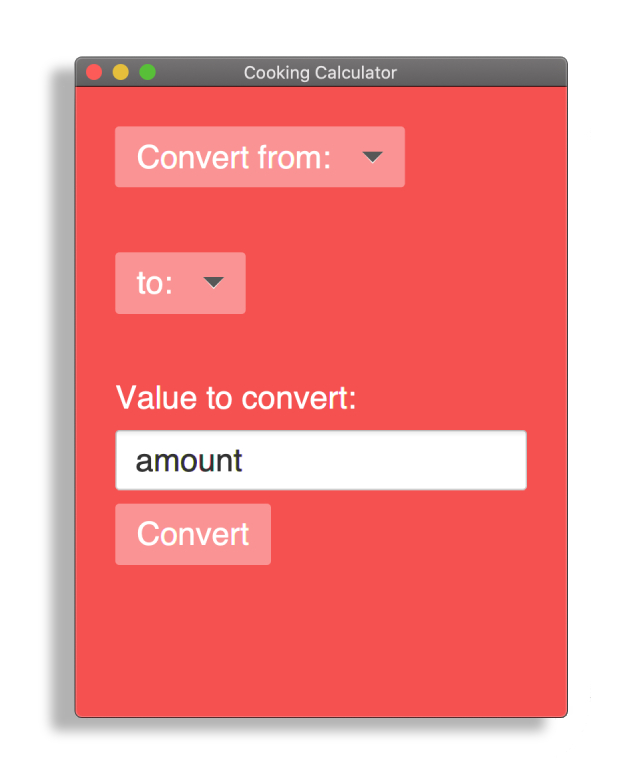
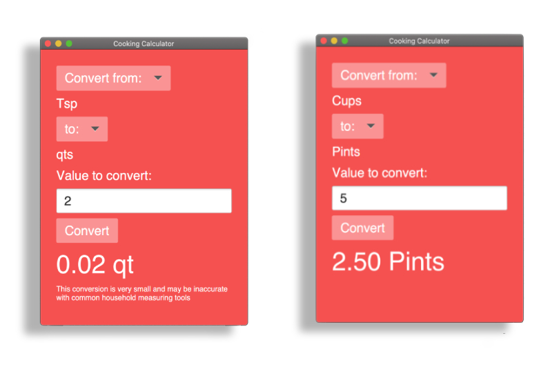

# Cooking Calculator
Desktop cooking conversion calculator for use with common kitchen measurements (US & milliliters).

1. Start by selecting the unit of measurements to convert from and to convert to. 
2. Provide the amount to be converted. 
3. Press "Convert".

Conversion is printed in large text.
If unit is missing or conversion amount too small, Cooking Calculator will issue a warning.

This project was built with Java, JavaFX, and CSS. 

## AUTHOR
Kate Grant

## CONTACT
hello.kategrant@gmail.com

